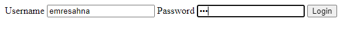
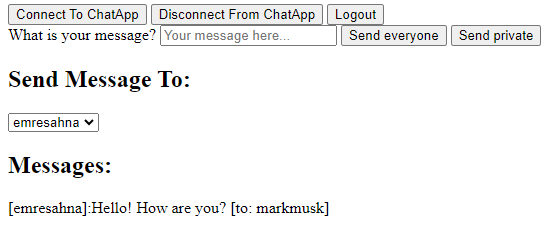
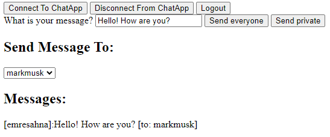

# Spring Boot WebSocket Example

This project is a simple example of how to use Spring Boot WebSocket. It is a simple chat application that allows users to send messages to each other.

## Technologies
- Java 17
- Spring Boot 3.1.1
- Spring WebSocket 6.0.10

## Screenshots

## Resources
- [Spring Boot WebSocket](https://spring.io/guides/gs/messaging-stomp-websocket/)
- [Spring WebSocket](https://docs.spring.io/spring-framework/docs/current/reference/html/web.html#websocket)